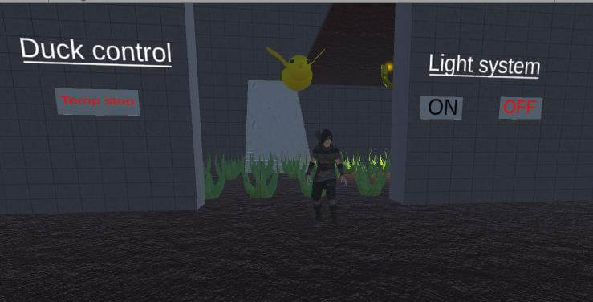
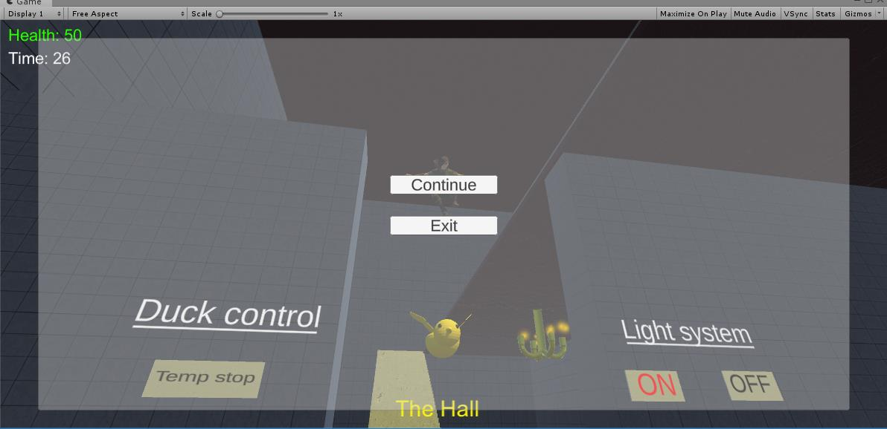

# Menús inmersivos en Unity (TATV)

Construcción de menús inmersivos en Unity utilizando raycast con el Mouse.
Se implementa un menú inicial, un menú inmersivo durante el juego y un menú de pausa.

## Capturas

